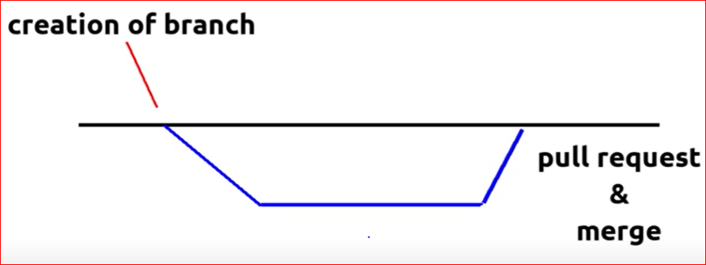
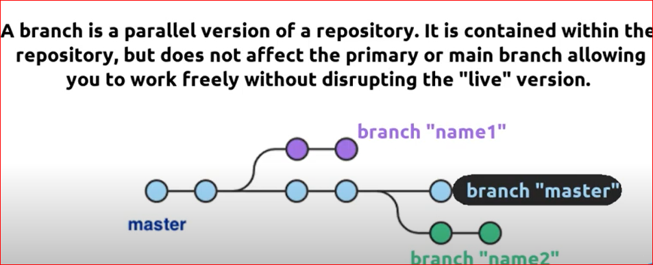

<h2>Welcome to my Poc for serverless cicd use case!!!</h2>

cmd-1: git init ->{This command is used to initialize a project} 
   cmd-2: git add . ->{This command is used to add all the changes} 
   cmd-3: git commit -a -m "write comments here" 
   cmd-4: create origin for every new repo 
   cmd-5: Run the following cmd after that -> git push origin1 master

<h4>Process to checkout a branch in git:</h4>

  

  

<h4>Create a AWS Serverless Templete:</h4>

    Run the following command -> {serverless create --template aws-python3} 

PS C:\Users\vamshi krishna\Downloads\serverless_usecase> git add .
warning: in the working copy of 'serverless.yml', LF will be replaced by CRLF the next time Git touches it
PS C:\Users\vamshi krishna\Downloads\serverless_usecase> git commit -a -m "pushing-git-actions"
[main 47cef2c] pushing-git-actions
 1 file changed, 2 insertions(+)
PS C:\Users\vamshi krishna\Downloads\serverless_usecase> git push -u origin1 main

